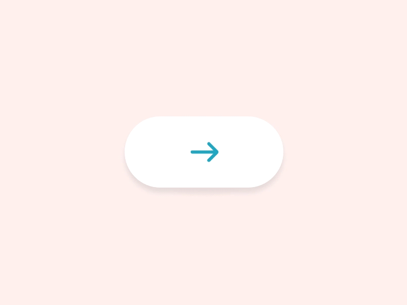

# DRSubmitButton

A custom submit button with normal, loading, success and warning state.

[](https://travis-ci.org/Samuel/ISUActionMenu)
[](http://cocoapods.org/pods/ISUActionMenu)
[](http://cocoapods.org/pods/ISUActionMenu)
[](http://cocoapods.org/pods/ISUActionMenu)



This is original inspired from a work on [Pinterest](https://www.pinterest.com/pin/536139530623020911/), written in Swift with full implementation of animations.

# Installation

## Cocoapods

Install Cocoapods if need be

```bash
$ gem install cocoapods
```

Add NVActivityIndicatorView in your `Podfile`

```bash
use_frameworks!

pod 'DRSubmitButton'
```

Then, run the following command

```bash
$ pod install
```

## Manual

Copy DRSubmitButton.swift to your project. That's it.

# Usage

Firstly, import DRSubmitButton

```swift
import DRSubmitButton
```

## Initialization

Initialize your button with simple line of init method:

```swift
submitButton.init(frame: CGRectMake(0, 0, 160, 60))
```

Implement your button with the usual addTarget method:

```swift
submitButtonDemo.addTarget(self, action: #selector(ViewController.demoFunction))
```

## Button State

The action will be triggered only during the .normal state. You can simply change the button state to *loading* state by:
```swift
submitButtonDemo.buttonState = .loading
```
*success* state by:
```swift
submitButtonDemo.buttonState = .success
```

## Customize

The icon images are fully customizable including:
1. Submit Icon
2. Success Icon
3. Warning Icon
```swift
submitButtonDemo.submitImage = UIImage(named: "icon_submit");
```

The color themes are fully customizable including:
1. All Icon's Color
2. All Background Color
```swift
submitButtonDemo.submitIconColor = UIColor(red: 6/255, green: 164/255, blue: 191/255, alpha: 1.0)
submitButtonDemo.normalBackgrounColor = UIColor(red: 1.0, green: 1.0, blue: 1.0, alpha: 1.0)
```

# License

The MIT License (MIT)

Copyright (c) 2016 Samuel Kao
